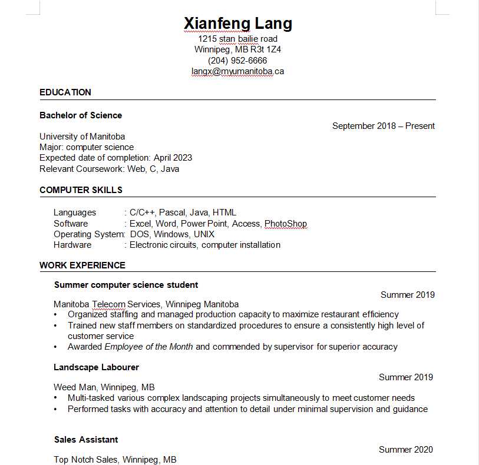

# How to host and format a resume
Purpose: Describe the practical steps of how to host and format a resume using MarkdownPad.  
## Prerequisites

 Xianfeng Lang  

 1215 stan bailie road 

 Winnipeg, MB R3T 2Z4 

 (204)952-6666 

 LANGX@myumanitoba.ca 

#### Education

---

**Bachelor of Science**  

 September 2018 – Present 
  
University of Manitoba   
Major: computer science   
Expected date of completion: April 2023   
Relevant Coursework: Web, C, Java   

#### COMPUTER SKILLS  
---  
Languages&emsp;&emsp;&emsp;: C/C++, Pascal, Java, HTML   
Software&emsp;&emsp;&emsp;&nbsp;&nbsp;&nbsp;&nbsp;: Excel, Word, Power Point, Access, PhotoShop  
Operating System:  DOS, Windows, UNIX  
Hardware&emsp;&emsp;&emsp;&nbsp;&nbsp;&nbsp;: Electronic circuits, computer installation  

#### WORK EXPERIENCE
---
**Summer computer scicence student**

 Summer 2019 

Manitoba Telecom Services, Winnipeg Manitoba  
• Organized staffing and managed production capacity to maximize restaurant efficiency  
• Trained new staff members on standardized procedures to ensure a consistently high level of customer service  
• Awarded Employee of the Month and commended by supervisor for superior accuracy  
**Landscape Labourer**

Summer 2019 

Weed Man, Winnipeg, MB  
• Multi-tasked various complex landscaping projects simultaneously to meet customer needs  
• Performed tasks with accuracy and attention to detail under minimal supervision and guidance  
**Sales Assistant**  

 Summer 2020 

Top Notch Sales, Winnipeg, MB   
• Collaborated with team members to achieve high sales numbers in a high pressure environment  
• Interacted professionally with customers to determine needs and advise on selections  

#### VOLUNTEER EXPERIENCE
---
**Public Relations Officer** - Psychology Students’ Association    

 May 2019 – present 

University of Manitoba, Winnipeg, MB   
• Conduct independent research on academic honesty practices for the Psychology Students’ Association   
• Hold Editor-in-Chief position for Psych News newsletter, including supervising a team of editors to meet deadlines   
• Keep record of Psychology Department news releases for future teams to assist in decision making   

#### ACTIVITIES & INTERESTS  
---
Web design, ham radio, hockey, and travelling  

## Instruction
#### Step 1: Format your resume by markdown editor 
 
#### Step 2: Update your resume to github
#### Step 3: Download a theme for your resume

## More Resources
1. [Markdown Tutorial](https://www.markdownguide.org/basic-syntax/) 
2. [Modern Technical Writing by Andraw Etter](https://www.amazon.ca/Modern-Technical-Writing-Introduction-Documentation-ebook/dp/B01A2QL9SS)  
3. [An intro to Github](https://product.hubspot.com/blog/git-and-github-tutorial-for-beginners)  
## Authors 
Xianfeng Lang - Provided the resume   
## Acknowledgments
Andraw Etter - provided the book "Modern Technical Writing"  
## FAQs
1. **Why is Markdown better than a word processor?**  
Markdown can present rich text layout effects but is lighter than word processor.  
2. **Why is my resume not showing up?**  
Sometimes github page is slow to process, and it only needs to be refreshed a few times.  
